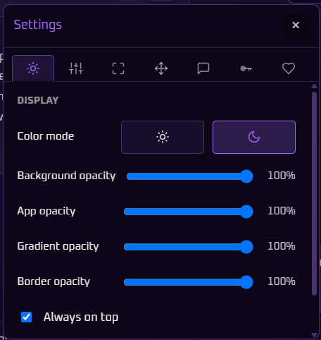

  

<h1 align="center">Comodo AI Companion</h1>

  <em>Always-on-top Windows overlay for in-game chat, game context, and Modo Muze.</em>

  
  

---

## Description

When I’m in a game, the last thing I want is to Alt-Tab into Discord, a browser, or a wiki just to ask a simple question, look up a track, or find a guide. I wanted something that sits with me while I play — helpful when I need it, and out of the way when I don’t.

**Comodo AI Companion** is that idea as a Windows overlay. It stays on top of your game so you can chat with Comodo Ai. It can pick up what game you’re running for better context, and **Modo Muze** listens to your game audio to identify the soundtrack when a track hits. There’s also a path for video lookup when you want a quick visual answer, plus the usual overlay polish: always-on-top, opacity settings, auto-hide to a dock, click-through with a recovery hotkey, and in-app updates.

Under the hood it’s a Tauri + React desktop app with small local helpers for game detection and Muze, and a cloud API for chat and a few online features.

This repository is the public home for installs and project info from an independent developer. Grab the latest Windows installer from [Releases](https://github.com/deziikuoo/Comodo-AI-Companion/releases).

Still early (**0.2.x**) and actively evolving — shared so people can try it out, send feedback, and follow along to see where it’s headed.

---

## Showcase

<!-- Drop screenshots and GIFs into assets/showcase/ and uncomment or add rows below. -->

| Chat & overlay | Modo Muze | Settings / dock |
| :---: | :---: | :---: |
|  |  |  |

| Auto-hide / dock | Game context | More |
| :---: | :---: | :---: |
|  |  |  |

> **Tip:** Add files named like `chat.png`, `muze.png`, `settings.png`, `dock.gif`, etc. under [`assets/showcase/`](assets/showcase/). Replace or extend the table as you capture more.

---

## Google Gemini (bring your own key)

Comodo Ai uses **Google Gemini** on the **free tier**. You create your own API key in [Google AI Studio](https://aistudio.google.com/apikey) and paste it into Comodo once (~2 minute set up, no credit cards, payments, or subscriptions).

### Quota

- Google’s free plan typically allows on the order of **~1,500 requests per day** per key (limits can change — check [AI Studio](https://aistudio.google.com/) / Google’s docs for current quotas).
- That allowance is **yours**, tied to your Google account — Comodo doesn’t give you a shared pool of keys.

### What we don’t store

- We **never see or store your Google password**. Sign-in happens on Google’s site.
- Your Gemini API key is stored **only on your PC** (OS keychain), not in this public repo and not as a Comodo-owned cloud secret.
- Chat is sent through Comodo’s cloud API to Google so the model can answer; we don’t keep your Google login credentials.
- Optional “Help improve Comodo” telemetry (if you turn it on) sends only an anonymous install ID, app version, OS/arch, and install/uninstall — not chat contents or your API key.

You can delete or replace the key anytime in AI Studio and in Comodo’s settings.

## Install guide

### Requirements

- **Windows 10/11** (64-bit)
- Network access for chat / updates (and Muze recognition when identifying tracks)
- A free **Google Gemini API key** if you want Comodo Ai chat (optional to try the shell)

### Steps

1. Open **[Releases](https://github.com/deziikuoo/Comodo-AI-Companion/releases/latest)**.
2. Download the latest **`Comodo AI Companion_*_x64-setup.exe`**.
3. Run the installer and follow the wizard.
4. Launch **Comodo AI Companion**.
5. When prompted (or later in **Settings**), connect free Gemini / Comodo Ai and paste your key from [Google AI Studio](https://aistudio.google.com/apikey).

### Notes

- Windows **SmartScreen** may warn on first run until a paid code-signing certificate is in place — choose *More info* → *Run anyway* if you trust the download from this repo.
- Closing the app stops **local** helpers on your machine; it does not shut down shared cloud infrastructure for everyone.
- Existing installs can use **Settings → Support → Check for updates** for in-app updates.

---

## Roadmap & future goals

Early roadmap — subject to change as the app grows:

- [ ] More polished onboarding and first-run experience  
- [ ] Stronger game-context awareness and suggestions while you play  
- [ ] Deeper Modo Muze library / discovery features  
- [ ] Smoother video-guide flows from chat   
- [ ] Quality-of-life overlay controls and accessibility  
- [ ] Listening to feedback from early users and shipping what matters most  

If something’s broken or you have an idea, open an issue or use in-app support feedback when available.

---

## About the developer

| | |
| ----------- | --------------------------------------------------------------------------------------------------------------------------------------------------- |
| **Name** | Dawan Rashad Wright — Sensophy |
| **Role** | Indie developer — design, product, and engineering |
| **Links** | [GitHub](https://github.com/deziikuoo) · [LinkedIn](https://www.linkedin.com/in/dawan-wright/) · [Buy Me a Coffee](https://buymeacoffee.com/deziikuoo) |
| **Contact** | [ifdawanprintqualified14@gmail.com](mailto:ifdawanprintqualified14@gmail.com) |

---

## License

Proprietary. **Not open source.**  
© Dawan Rashad Wright. All rights reserved. See [LICENSE](LICENSE).

You may download and use the released Windows installer from this repository’s Releases. Source code is not licensed for copying, modification, or redistribution.
